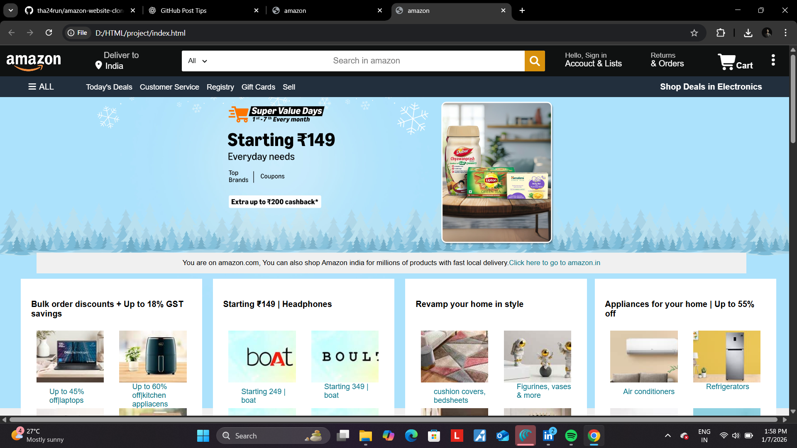
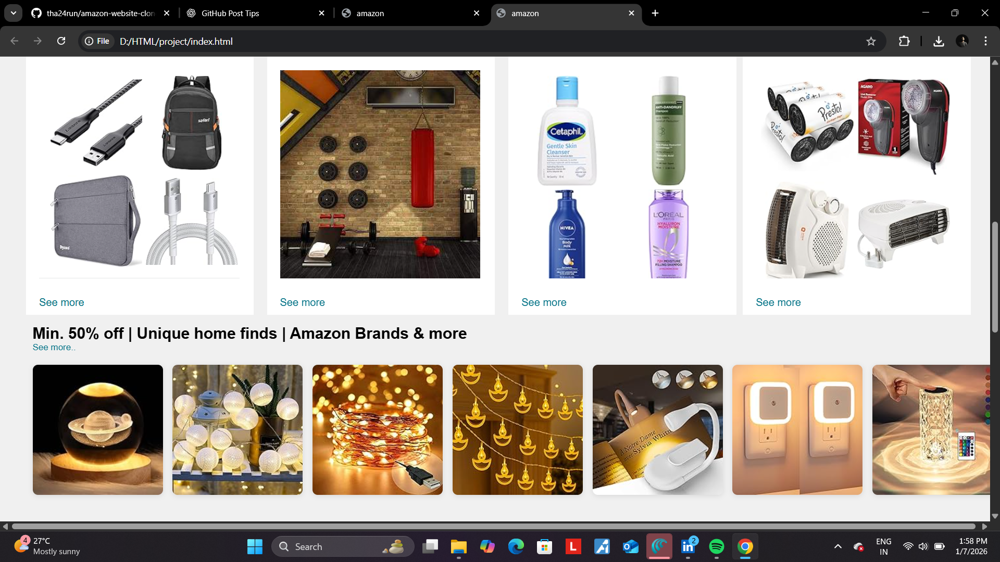
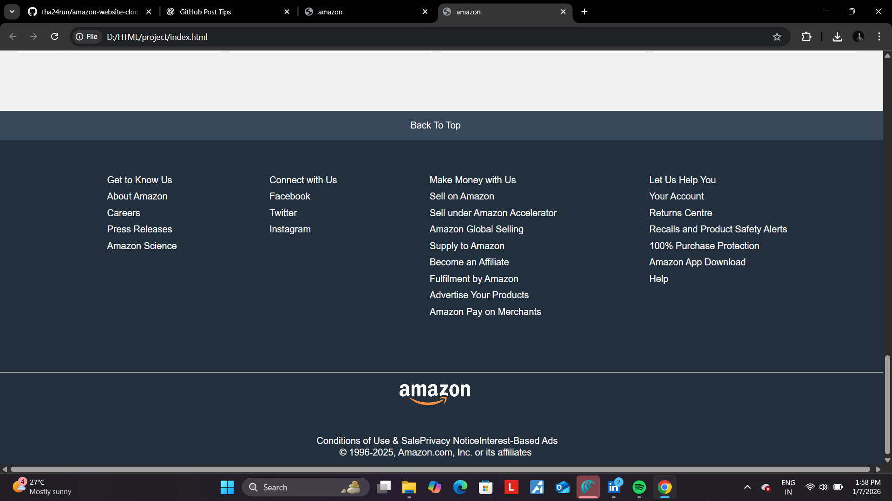

# amazon-website-clone
Amazon homepage clone using HTML &amp; CSS | Beginner frontend project

# Amazon Website Clone 🛒

A frontend clone of the Amazon homepage built using **HTML5 and CSS3**.
This project focuses on layout design, styling, and real-world UI cloning.

## 🚀 Features
- Amazon-style navbar with search bar
- Hero banner section
- Product grid layout
- Deals & cards section
- Footer with multiple columns
- Clean UI using pure CSS

## 🛠️ Technologies Used
- HTML5
- CSS3

## 📸 Screenshots

## 📚 What I Learned
- Structuring large HTML pages
- CSS Flexbox & layout techniques
- Image grids and cards
- Building real-world UI clones

## ⚠️ Disclaimer
This project is created **only for educational purposes**.
All images and brand names belong to their respective owners.

## 👤 Author
**Putthur Tharun Achari**  
B.Tech CSM (AI & ML)
